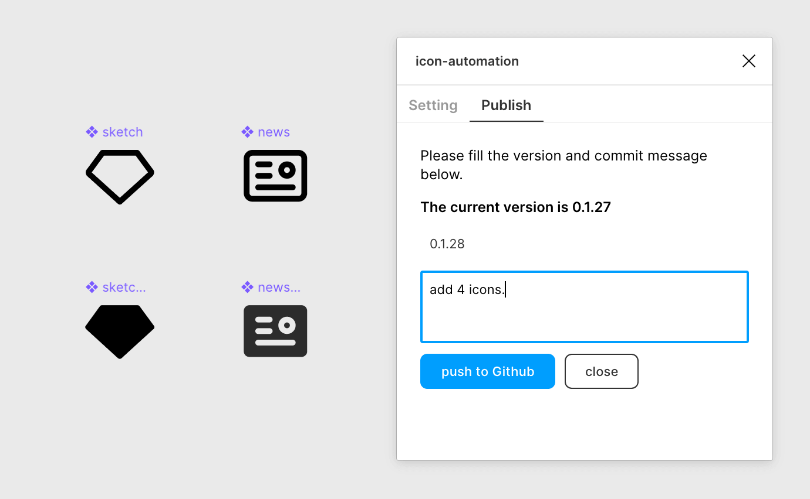
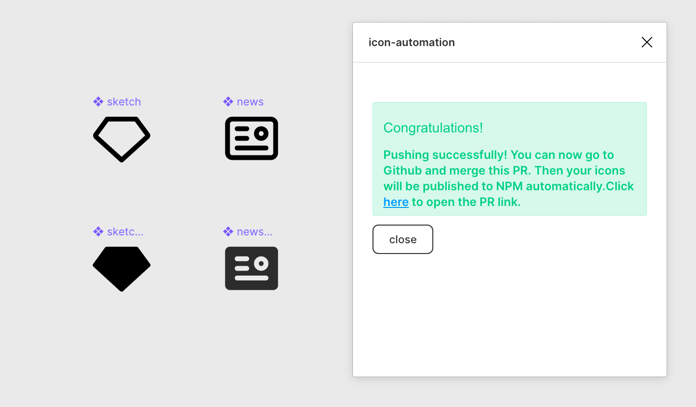
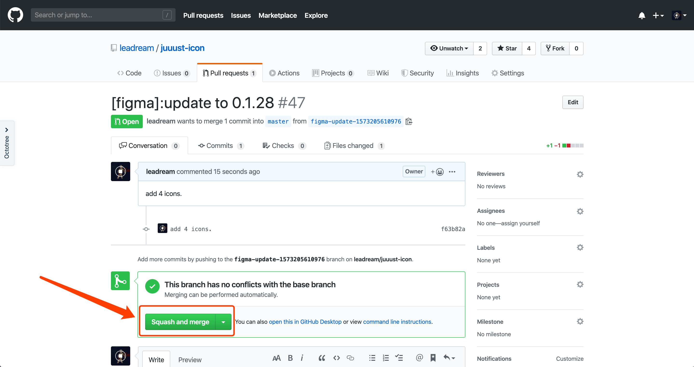
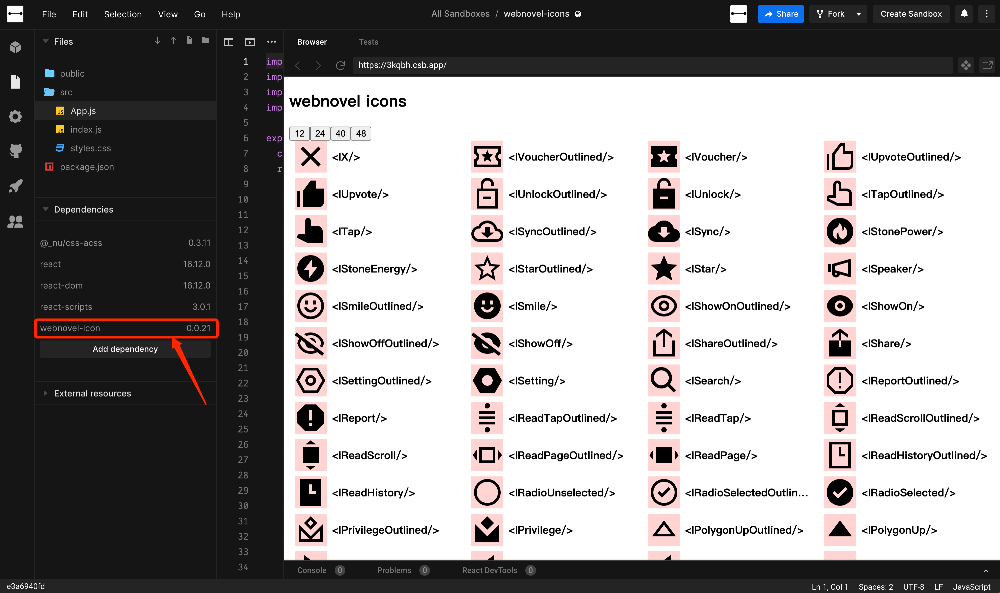

# Icon Automation Workflow Using Figma

It's a repository for [Figma Icon Automation Plugin](https://github.com/leadream/figma-icon-automation).


## in react 

```JSX
import { ISmile } from "mqq-icons";

function App(){
    return (<svg {...ISmile} width="16" height="16" />);
};
```

## 安装 Figma 插件 / Install figma plugin

- [figma-icon-automation](https://www.figma.com/community/plugin/739395588962138807/figma-icon-automation)

点击链接下载插件。

## 配置 / settings 


- **GitHub Repo Url**: `https://github.com/yued-fe/webnovel-icons`
- **GitHub token**：联系 [ziven27](https://github.com/ziven27) 获取

1. 打开 Figma 并呼起 `figma-icon-automation` 插件。
2. 填写 GitHub Repo Url 也就是当前 Github 地址。
3. 填写 GitHub Token.

## 发布 / Publish



1. 点击 Update 按钮，跳转到 Publish 页卡。
2. 一定要等到出现黑色加粗文字 `The current version is *.*.*`。
3. 然后填写想要发布的新的版本号，和修改信息，并点击 `push to Github`。

## 合并分支 / Pull requests





1. 点击 `here` 
2. 再点击 `Squash and merge`。

## 查看效果 / Preview



- [codesandbox](https://codesandbox.io/s/mqq-icons-odcm1)

然后点击以上链接，并在 Dependencies 中升级 [mqq-icons](https://www.npmjs.com/package/mqq-icons) 到刚刚 Figma 中发布的版本，即可看到效果。
